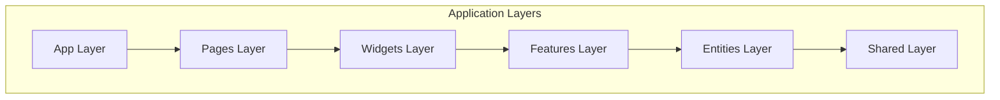
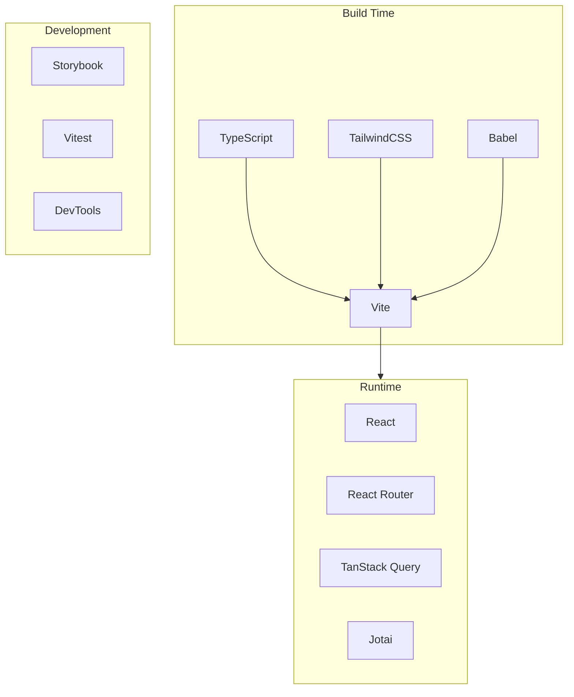
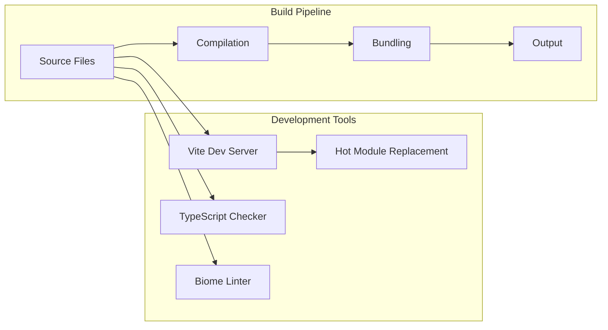
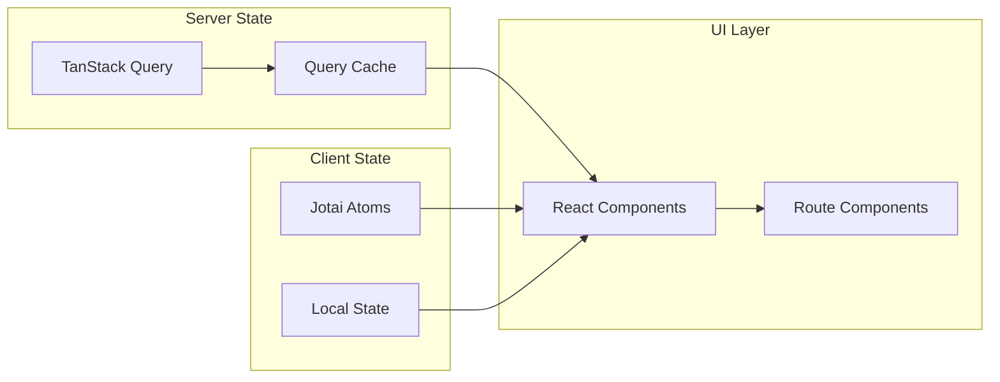
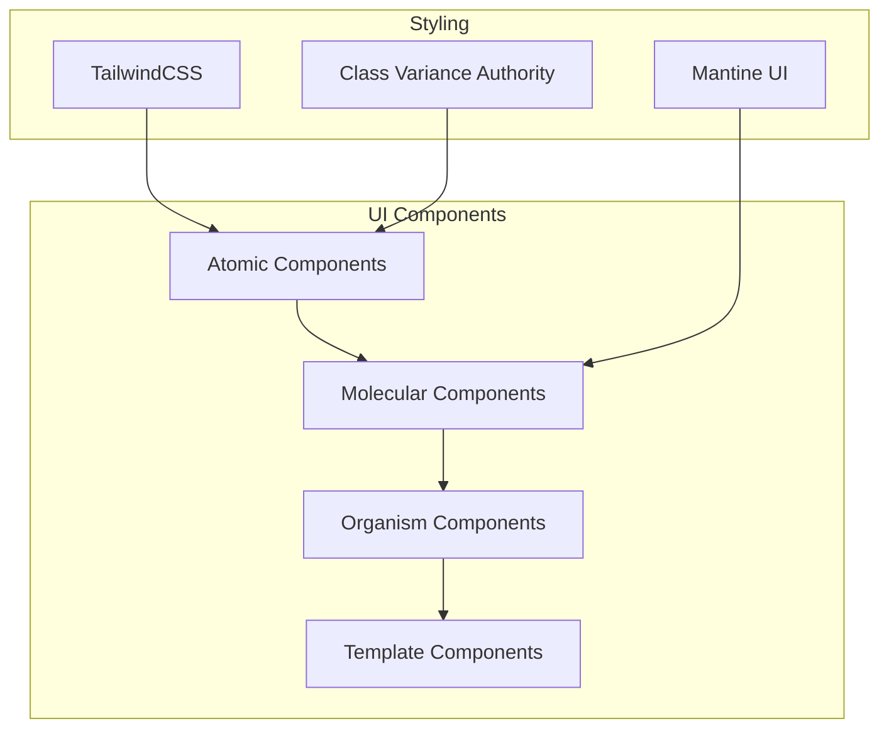
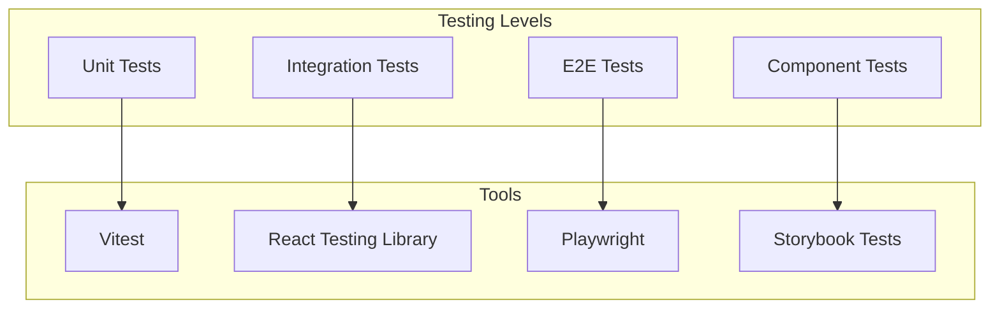
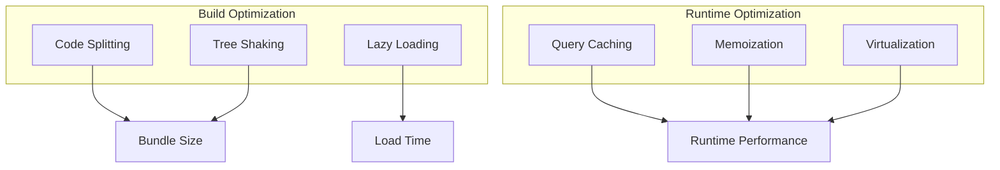
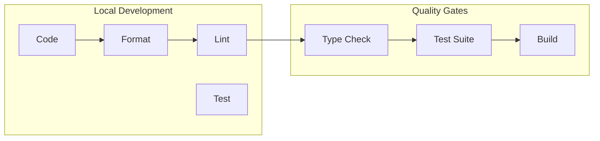

# Frontend Architecture Documentation

## Table of Contents
1. [Overview](#overview)
2. [Technical Architecture](#technical-architecture)
3. [Application Structure](#application-structure)
4. [Development Environment](#development-environment)
5. [State Management & Data Flow](#state-management--data-flow)
6. [UI/UX Architecture](#uiux-architecture)
7. [Testing Strategy](#testing-strategy)
8. [Performance Considerations](#performance-considerations)
9. [Developer Experience](#developer-experience)

## Overview

The frontend application is built using modern React with React Router, following Feature-Sliced Design (FSD) principles. It leverages Vite for build tooling and includes comprehensive testing, internationalization, and state management solutions.

### Key Technologies
- React 19.1
- React Router 7.6
- Vite 6.3
- TailwindCSS 4.1
- Mantine UI 8.0
- TypeScript 5.8
- Storybook 9.0
- Vitest 3.1

## Technical Architecture

### Application Layer Structure



### Build and Runtime Architecture



## Application Structure

### Directory Organization
```
app/
├── app/ # Application-wide setup and configuration
├── pages/ # Route components and page layouts
├── widgets/ # Complex UI components combining features
├── features/ # Business logic and feature implementations
├── entities/ # Business entities and their logic
├── shared/ # Shared utilities, types, and components
├── library/ # UI component library
└── server/ # Server-side rendering logic
```

### Key Files
- `root.tsx` - Application root component and layout setup
- `entry.client.tsx` - Client-side hydration and i18n setup
- `entry.server.tsx` - Server-side rendering configuration
- `routes.ts` - Route definitions with locale support
- `theme.ts` - Mantine theme configuration

## Development Environment

### Build System Architecture



### Development Features
- Hot Module Replacement with Vite
- TypeScript type checking
- Biome for linting and formatting
- React Router DevTools integration
- TanStack Query DevTools
- Storybook for component development

## State Management & Data Flow

### Data Flow Architecture



### State Management Solutions
- Jotai for global state
- TanStack Query for server state
- React Query DevTools for debugging
- Type-safe state management

## UI/UX Architecture

### Component Library Structure



### Design System Integration
- TailwindCSS for utility-first styling
- Mantine UI for advanced components
- Custom theme configuration with CSS layers
- Responsive design patterns
- Accessibility compliance with a11y addon

## Testing Strategy

### Testing Architecture



### Testing Tools
- Vitest for unit and integration testing
- React Testing Library for component testing
- Storybook for visual testing and documentation
- Coverage reporting with v8

## Performance Considerations

### Performance Optimization



### Key Performance Features
- Code splitting by route
- Lazy loading of components
- Query caching with TanStack Query
- Server-side rendering
- Optimized asset loading

## Developer Experience

### Development Workflow



### Developer Tools
- Comprehensive TypeScript support
- Biome for code quality
- Hot Module Replacement
- Development server with SSR
- React DevTools integration
- Query DevTools
- Storybook development environment

## Getting Started

### Prerequisites
- Node.js >=20.0.0
- Yarn package manager

### Development Commands
```bash
# Start development server
yarn dev

# Run tests
yarn test
yarn test:ui    # With UI
yarn test:cov   # With coverage

# Start Storybook
yarn storybook

# Type checking
yarn lint

# Build for production
yarn build
```

## Best Practices

### Code Organization
1. Follow Feature-Sliced Design principles
2. Keep components small and focused
3. Use TypeScript for type safety
4. Implement lazy loading for routes
5. Follow accessibility guidelines

### State Management
1. Use Jotai for global state
2. Implement TanStack Query for API calls
3. Leverage React Query's caching
4. Keep state close to where it's used

### Performance
1. Implement code splitting
2. Use proper memoization
3. Optimize images and assets
4. Monitor bundle sizes
5. Implement proper caching strategies
