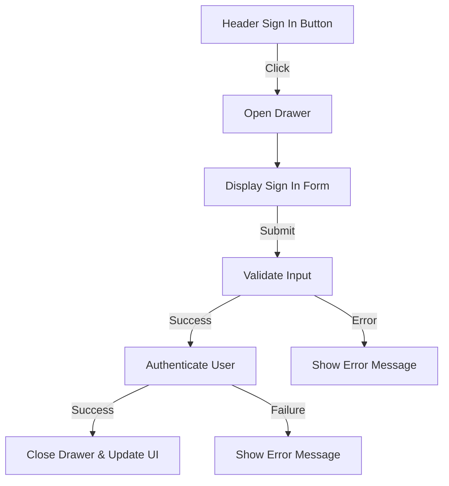
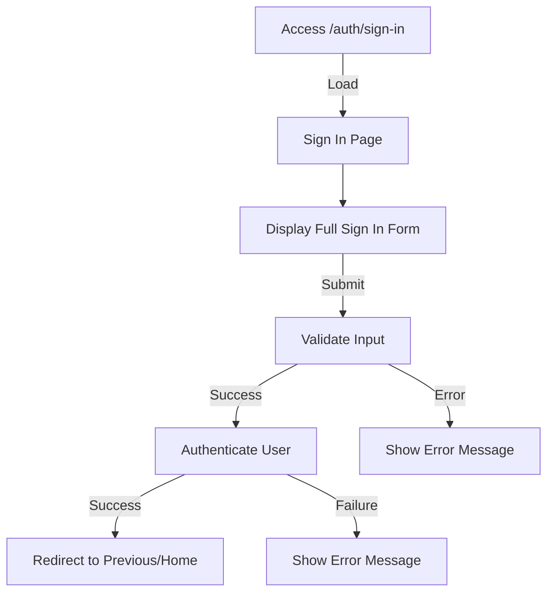
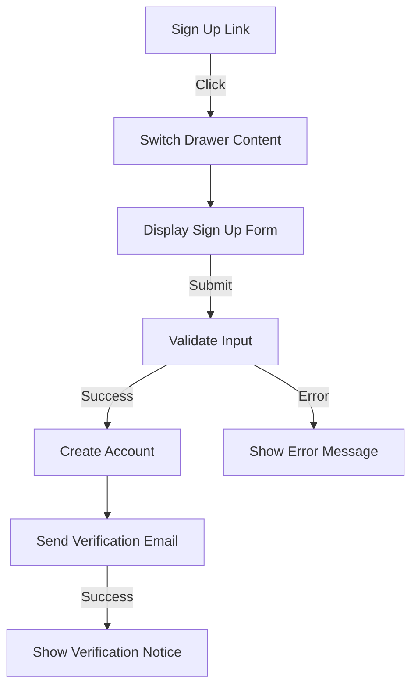
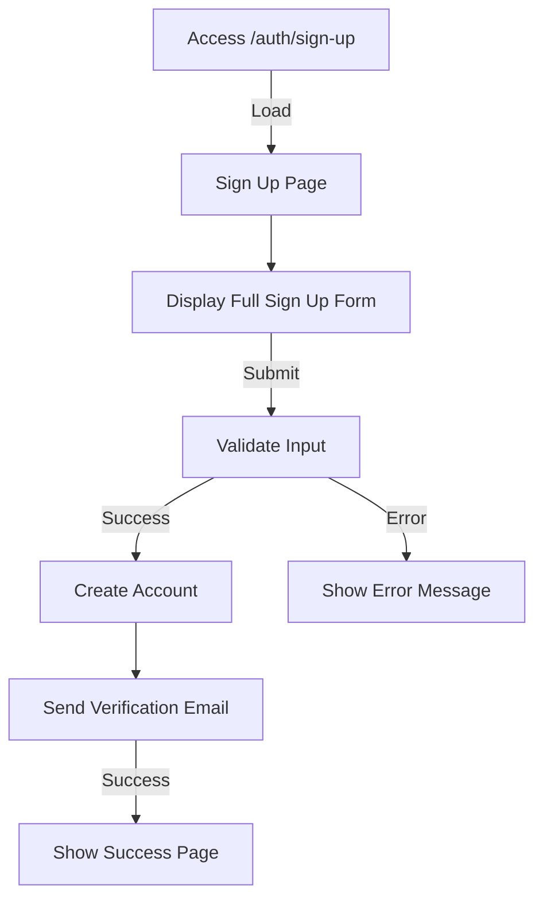
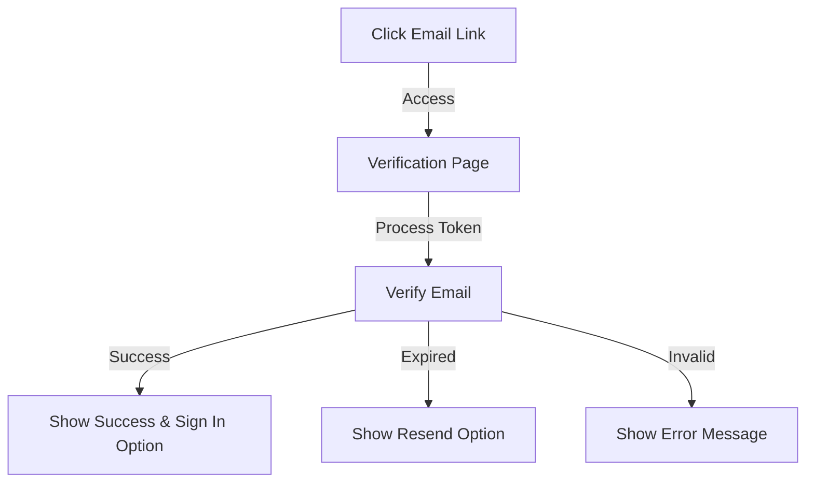
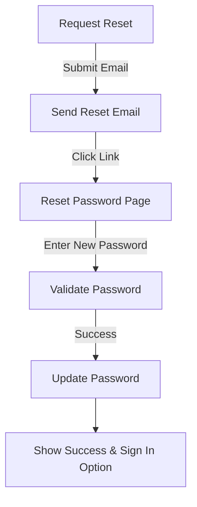

# Email Authorization System PRD

## 1. Overview

### 1.1 Purpose
Define a comprehensive email-based authorization system that provides secure authentication through both a dedicated page and a drawer interface, ensuring a seamless user experience while maintaining high security standards.

### 1.2 Scope
- Email-based authentication (sign in, sign up)
- Password management (reset, recovery)
- Email verification
- Multi-context authentication UI (page and drawer)
- Session management
- Security measures

## 2. User Stories and Requirements

### 2.1 Sign In

#### Drawer Context


**User Stories:**
1. As a user, I want to:
   - Click the "Sign In" button in the header to open the authentication drawer
   - See a clean, focused sign-in form
   - Sign in with my email and password
   - See clear error messages if something goes wrong
   - Have the drawer automatically close upon successful authentication
   - See my authenticated state reflected in the UI immediately

#### Dedicated Page Context


**User Stories:**
1. As a user, I want to:
   - Access a dedicated sign-in page via direct URL
   - See a professional, full-page authentication form
   - Have the option to remember my session
   - Be redirected to my intended destination after signing in
   - See a progress indicator during authentication

### 2.2 Sign Up

#### Drawer Context


**User Stories:**
1. As a new user, I want to:
   - Switch to sign up from the sign-in drawer
   - Fill out a comprehensive registration form
   - See password strength requirements in real-time
   - Receive immediate feedback on input validation
   - Get confirmation of successful registration
   - Be informed about the verification email

#### Dedicated Page Context


**User Stories:**
1. As a new user, I want to:
   - Access a dedicated sign-up page
   - See clear terms of service and privacy policy
   - Have optional fields for additional information
   - Receive a welcome email after registration
   - Be guided through the next steps after registration

### 2.3 Email Verification



**User Stories:**
1. As a new user, I want to:
   - Receive a clear verification email
   - Click a verification link that doesn't expire too quickly
   - See a confirmation page after successful verification
   - Have the option to resend the verification email
   - Be automatically signed in after verification

### 2.4 Password Reset



**User Stories:**
1. As a user, I want to:
   - Request a password reset from either interface
   - Receive a secure reset link via email
   - Set a new password with confirmation
   - See password requirements clearly
   - Get confirmation of successful password change

## 3. Technical Requirements

### 3.1 Security
- Implement CSRF protection
- Use secure HTTP-only cookies
- Rate limit authentication attempts
- Implement password hashing (bcrypt)
- Set secure password requirements
- Implement JWT with refresh tokens
- Add device tracking for suspicious activity

### 3.2 Form Validation
- Email format validation
- Password strength requirements:
  - Minimum 8 characters
  - At least one uppercase letter
  - At least one number
  - At least one special character
- Real-time validation feedback
- Server-side validation

### 3.3 State Management
- Use Jotai for global auth state
- Implement persistent session handling
- Handle multiple tabs/windows
- Manage loading and error states
- Handle token refresh flow

### 3.4 UX Requirements
- Maximum 3-second response time
- Clear error messages
- Loading indicators
- Smooth transitions
- Responsive design
- Accessibility compliance

## 4. User Interface Specifications

### 4.1 Drawer Interface
- Width: 400px on desktop, full-width on mobile
- Right-side placement
- Smooth animation
- Backdrop overlay
- Close button
- Form progress indicator
- Social proof elements

### 4.2 Dedicated Page
- Centered layout
- Maximum width: 480px
- Branded elements
- Security indicators
- Help section
- Contact support option
- Remember me option

### 4.3 Form Elements
- Email input
- Password input with visibility toggle
- Remember me checkbox
- Forgot password link
- Sign in/up button
- OAuth provider buttons (future)
- Error message area
- Loading states

## 5. Error Handling

### 5.1 User-Facing Errors
- Invalid email format
- Weak password
- Account already exists
- Invalid credentials
- Account not verified
- Too many attempts
- Network error
- Server error

### 5.2 Error Recovery
- Clear error messages
- Suggested actions
- Support contact option
- Automatic retry for network issues
- Session recovery mechanisms

## 6. Success Metrics

### 6.1 Performance Metrics
- Sign-in completion < 30 seconds
- Form submission < 2 seconds
- Error rate < 5%
- Verification email delivery < 2 minutes

### 6.2 User Success Metrics
- Sign-up completion rate > 85%
- Verification completion rate > 90%
- Password reset completion rate > 95%
- First-attempt success rate > 80%

## 7. Future Considerations

### 7.1 Planned Enhancements
- Social authentication
- Two-factor authentication
- Remember device option
- Multiple email support
- Account linking
- Enhanced security options

### 7.2 Integration Points
- Analytics tracking
- User onboarding flow
- Profile completion
- Preference setting
- Newsletter opt-in

## 8. Implementation Status (as of March 2024)

### 8.1 Completed Features

#### Authentication UI
- ✅ Drawer-based authentication interface
- ✅ Dedicated authentication pages
- ✅ Clean, modern UI using Mantine components
- ✅ Responsive design
- ✅ Form validation with real-time feedback
- ✅ Error message handling
- ✅ Loading states during authentication
- ✅ Internationalization support with i18n

#### Authentication Flow
- ✅ Sign In functionality (static data)
- ✅ Sign Up functionality (static data)
- ✅ Password reset request flow (static data)
- ✅ Navigation between auth modes (sign in/up/forgot)
- ✅ Session state management with Jotai
- ✅ Automatic drawer closing on success
- ✅ Proper routing with locale support

### 8.2 Pending Features

#### Backend Integration
- ⏳ Real API integration for authentication
- ⏳ Persistent session management
- ⏳ Token-based authentication
- ⏳ Refresh token mechanism

#### Email Features
- ⏳ Email verification system
- ⏳ Password reset email delivery
- ⏳ Email templates
- ⏳ Email verification status UI

#### Security Features
- ⏳ CSRF protection
- ⏳ Rate limiting
- ⏳ Device tracking
- ⏳ Suspicious activity detection

#### Additional Features
- ⏳ Remember me functionality
- ⏳ OAuth provider integration
- ⏳ Multi-device session management
- ⏳ Account recovery options

### 8.3 Current Limitations
1. Uses static mock data for authentication
2. No persistent storage of user sessions
3. No real email functionality
4. Basic password validation only
5. No advanced security features implemented

### 8.4 Next Steps
1. Integrate with backend authentication API
2. Implement email verification flow
3. Add persistent session storage
4. Enhance security measures
5. Add OAuth providers
6. Implement advanced password policies

### 8.5 Testing Status
- ✅ Basic form validation
- ✅ UI component rendering
- ✅ Navigation flows
- ⏳ Integration tests
- ⏳ E2E tests
- ⏳ Security testing

### 8.6 Current Test Credentials
```
Email: test@example.com
Password: password
```

Note: These credentials are for MVP testing only and will be removed once real authentication is implemented.