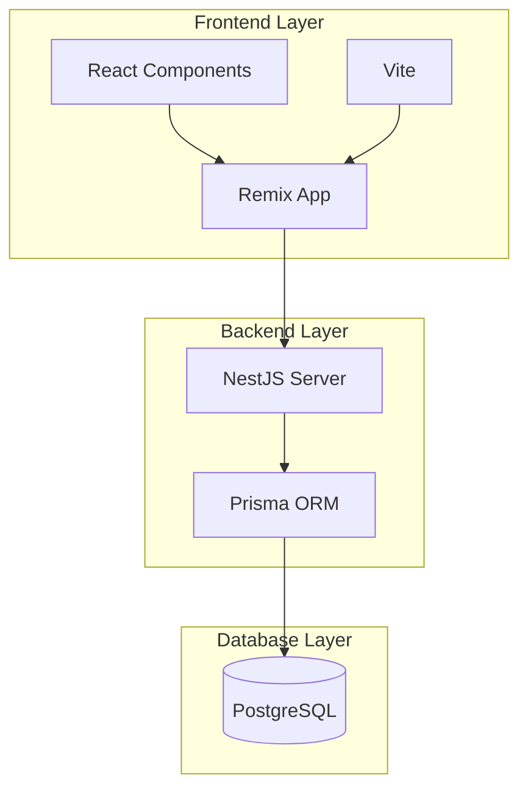
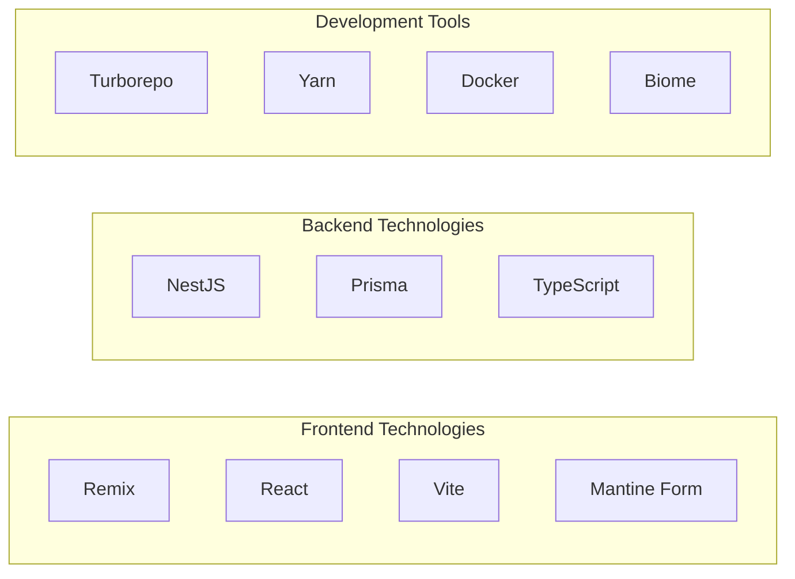
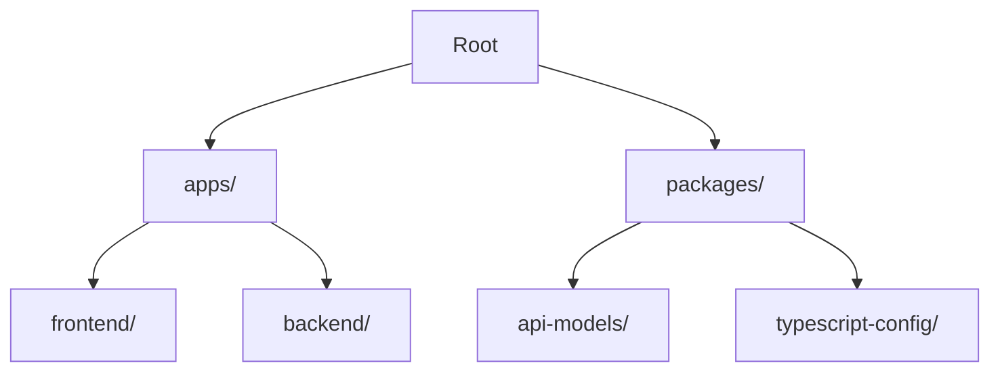
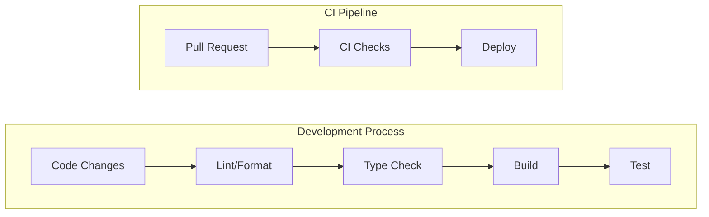
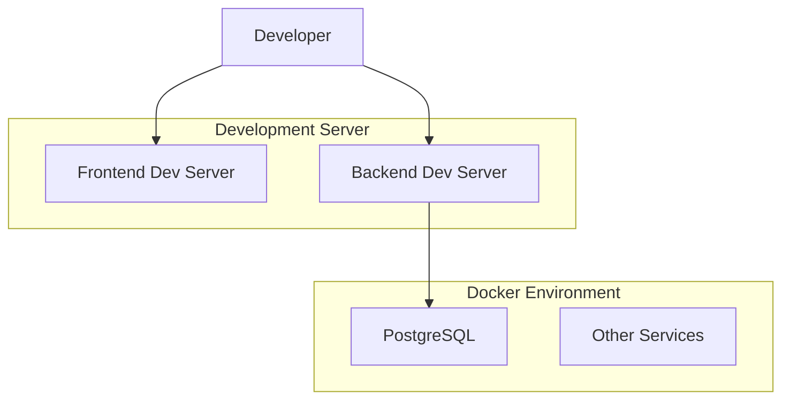

# Boilerplate Project Architecture Documentation

## Table of Contents
1. [Overview](#overview)
2. [Technical Architecture](#technical-architecture)
3. [Development Workflow](#development-workflow)
4. [Project Structure](#project-structure)
5. [Infrastructure](#infrastructure)
6. [Quality Assurance](#quality-assurance)
7. [Product Perspective](#product-perspective)

## Overview

This is a modern full-stack boilerplate project that combines Remix for the frontend and NestJS for the backend. The project is designed with a monorepo structure using Yarn workspaces and Turborepo for efficient development workflow.

### Key Features
- Full-stack TypeScript development
- Monorepo architecture
- Modern development tooling
- Docker-based development environment
- PostgreSQL database integration
- Comprehensive code quality tools

## Technical Architecture

### System Architecture



### Development Stack



## Development Workflow

### Monorepo Structure



### Build and Development Process



## Project Structure

### Apps Directory
- **frontend/**
  - Modern Remix application
  - Vite for build tooling
  - React Router for navigation
  - Storybook for component development
  - Vitest for testing

- **backend/**
  - NestJS application
  - Prisma for database ORM
  - Custom logging
  - API endpoints
  - Authentication & Authorization

### Packages Directory
- **api-models/**
  - Shared TypeScript interfaces
  - API contract definitions

- **typescript-config/**
  - Shared TypeScript configurations
  - Common type definitions

## Infrastructure

### Local Development Environment



### Database Schema
The project uses PostgreSQL with Prisma as the ORM layer. Database migrations and schema changes are managed through Prisma.

## Quality Assurance

### Code Quality Tools
1. **Biome** - For linting and formatting
2. **TypeScript** - Static type checking
3. **Vitest** - Unit and integration testing
4. **Knip** - Unused exports detection
5. **Lefthook** - Git hooks management
6. **Commitlint** - Commit message standardization

### Testing Strategy
- Unit tests with Vitest
- Component testing with Storybook
- Integration tests for API endpoints
- End-to-end testing capabilities

## Product Perspective

### Developer Experience
- Fast local development with hot reloading
- Consistent code style through automated tooling
- Comprehensive documentation
- Efficient monorepo structure
- Type safety across the entire stack

### Scalability Considerations
- Modular architecture for easy scaling
- Separate frontend and backend deployments
- Database optimization capabilities
- Docker-based infrastructure

### Maintenance and Updates
- Regular dependency updates through Yarn
- Automated testing prevents regressions
- Clear update paths for all components
- Version control best practices

## Getting Started

### Prerequisites
- Node.js >=22.15.0
- Yarn 4.2.2
- Docker and Docker Compose
- PostgreSQL (via Docker)

### Setup Instructions
1. Clone the repository
2. Run `yarn` to install dependencies
3. Start Docker services: `docker-compose up`
4. Set up the database:
   ```sql
   docker exec -it boilerplate-postgres-1 psql -U postgres
   CREATE DATABASE bolierplate
   ```
5. Start the backend:
   ```sh
   cd apps/backend
   yarn dev
   ```
6. Start the frontend:
   ```sh
   cd apps/frontend
   yarn dev
   ```

## Contributing

The project follows conventional commit messages and uses Commitizen for standardized commits. Development workflow is managed through Turborepo and enforced by various quality assurance tools.

### Development Commands
- `yarn dev` - Start development servers
- `yarn build` - Build all packages
- `yarn lint` - Run linting
- `yarn test` - Run tests
- `yarn check-types` - Check TypeScript types
- `yarn check:unused` - Check for unused exports
- `yarn commit` - Create a standardized commit message